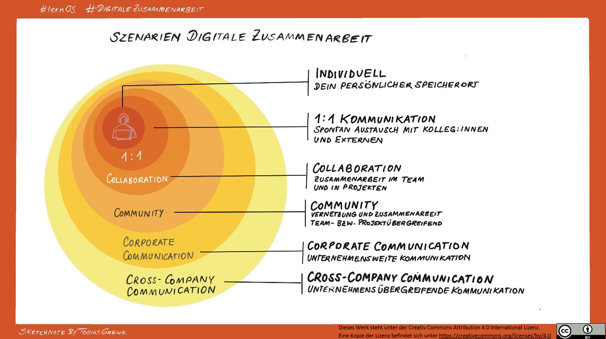

## Warum digitale Zusammenarbeit?

Wir kennen oder hören Buzzwörter wie "Digitale Transformation" und
"VUCA-Welt".

Konkret bedeutet das im beruflichen Kontext, dass neue Kompetenzen und
Skills aber auch andere Arbeitsweisen notwendig sind, um den aktuellen
Herausforderungen (z.B. Mobile Office, remote work, New Work) zu
begegnen. Dadurch entstehen auch neue Konzepte der Zusammenarbeit, auf
die man sich einlassen muss und darf.

Der Leitfaden für digitale Zusammenarbeit setzt genau dort an. Neben den
Tools stehen Methoden und Strategien der digitalen Zusammenarbeit,
Vernetzung und Wissensverbreitung im Vordergrund.

Viele Formate und Methoden, die in diesem Leitfaden auftauchen,
existieren auch in der analogen Welt. Hier werden Möglichkeiten gezeigt,
diese im digitalen Kontext umzusetzen. Zudem können viele sowohl
synchron (zeitgleich) als auch asynchron (zeitversetzt) angewendet
werden. In diesem Zusammenhang spricht man dann von Kollaborationstools,
die zum Einsatz kommen.

Im Folgenden seht ihr die verschiedenen Szenarien für digitale
Zusammenarbeit in Verbindung mit der Reichweite und den Tools:

