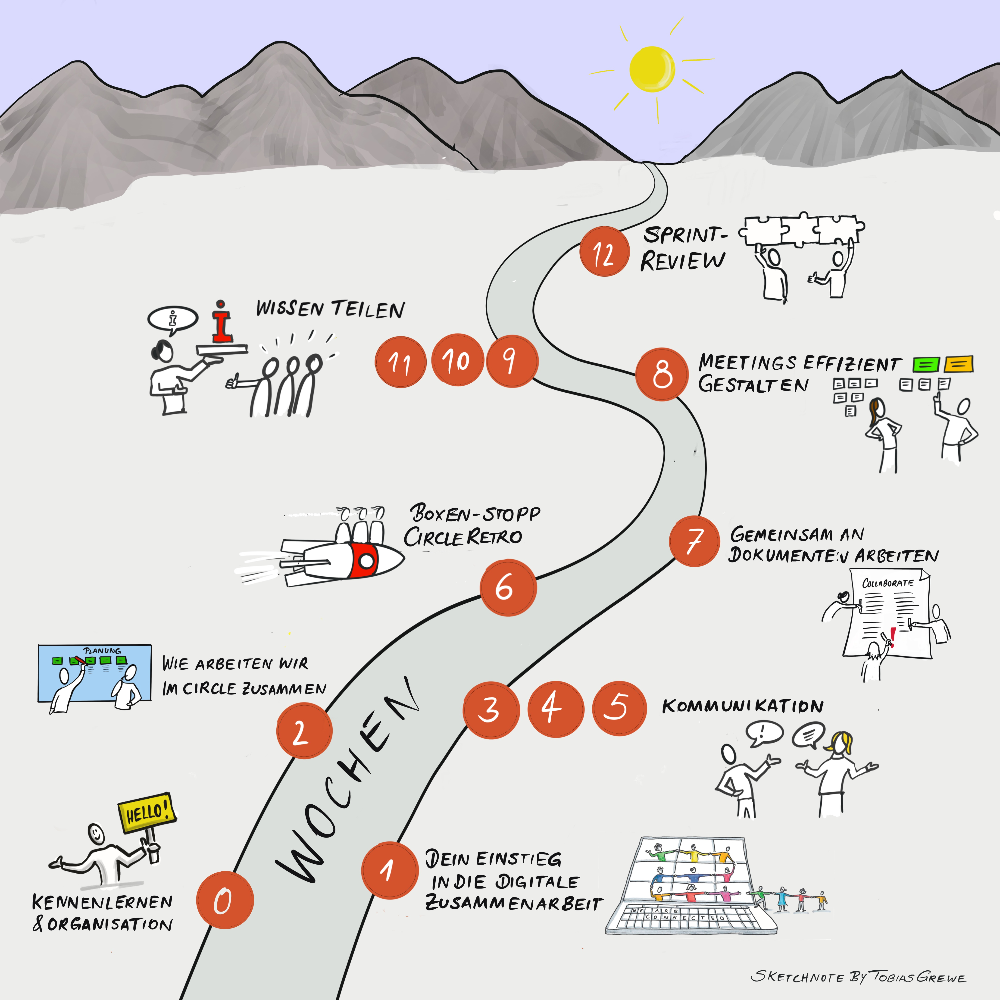
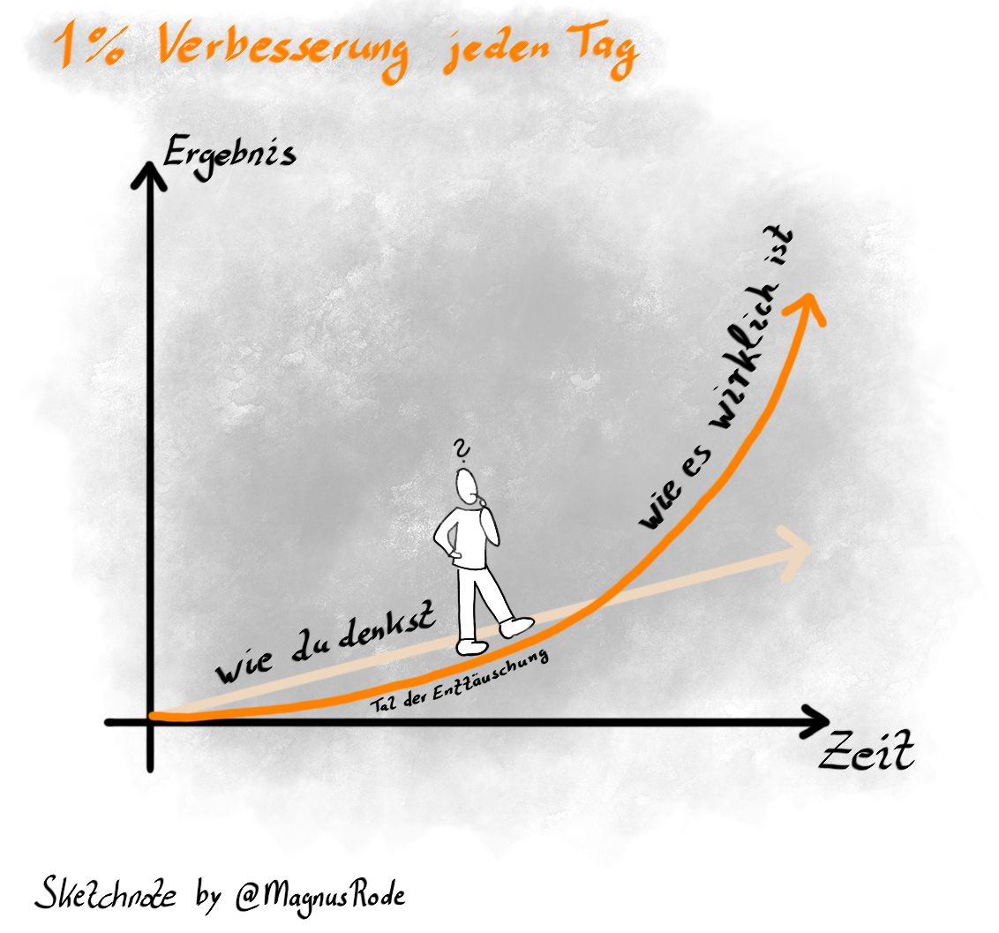

# Deine Lernreise im Überblick

In den nächsten 1 + 12 Wochen wirst du dich intensiv mit dem Thema
digitale Zusammenarbeit beschäftigen.

Hier die Wochen im Überblick:

-   In der **Woche 0** geht es darum, die Lernreise vorzubereiten, sich klar
    zu werden über die eigene Motivation und mit der Lerngruppe zu
    verabreden, wie ihr euch in der Zeit organisieren wollt.

-   In **Woche 1** beschäftigst du dich mit deinem individuellen Einstieg in
    die digitale Zusammenarbeit. Dazu erstellst du eine individuelle
    Standortbestimmung.

-   In **Woche 2** erstellt ihr gemein das Collaboration Canvas für eure
    Zusammenarbeit im Circle und legt damit eure Regeln der
    Zusammenarbeit fest.

-   In den **Wochen 3-5** geht es um verschiedene Aspekte rund um das Thema
    Kommunikation. Du lernst geeignete Tools aber auch Kanäle für die
    Kommunikation kennen und erfährst, wie du deine Kommunikation
    optimal ausrichtest.

-   In der **Woche 6** erfolgt ein Boxenstopp, indem ihr eine
    Circle-Retrospektive durchführt.

-   In **Woche 7** steht das gemeinsame Arbeiten an Dokumenten im
    Mittelpunkt. Du lernst, was dabei in der digitalen Zusammenarbeit zu
    berücksichtigen ist.

-   In **Woche 8** erhältst du Anregungen, wie du Meetings effizient
    gestalten kannst.

-   In den **Wochen 9-11** liegt der Schwerpunkt auf Wissen teilen. Du
    behandelst dabei die Aspekte "nehmen", "sichtbar werden" und
    "geben".

-   In der **Woche 12** erwartet dich ein Sprint-Review. Hier reflektierst
    du deine Lernreise.

Für jede Woche gibt es eine Agenda mit folgendem Aufbau:

-   Check-in

-   Hauptthema

-   Check-out

-   Hausaufgabe

Auf deiner Lernreise begegnest du wöchentlich einer sogenannten Kata, was so
viel wie "Übung" bedeutet. Die Lernreise ist so angelegt, dass du in
der Vor-Woche die jeweilige Kata für die nächste Woche als Hausaufgabe
vorbereitest, so dass ihr euch gemeinsam darüber im Circle austauschen
könnt.

Bitte plane pro Woche mindestens 2 Stunden Zeit ein: 1 Stunde für das
gemeinsame Treffen und 1 Stunde (oder mehr) für deine Hausaufgabe. Vor-
und Nachbereitungszeiten können dabei variieren.

Digitale Zusammenarbeit ist ein sehr umfangreiches Thema. Es können
nicht alle Aspekte gleichermaßen erarbeitet werden. Auch ist euer
Kenntnisstand jeweils unterschiedlich in den einzelnen Bereichen.

Bitte lege für dich deine Schwerpunkte fest und entscheide bei jeder
Kata, ob du zusätzlich zum Lernpfad noch mehr machen willst - es gibt in
jeder Kata weiterführende Tipps und Aufgaben für dich.

Bevor ihr euch auf den Weg macht, möchten wir euch die Kraft der kleinen
Schritte vorstellen, die euch bei eurem Lernprozess motivieren soll. Das
Diagramm von James Clear mit dem Titel „The Power of Tiny Gains" zeigt
anschaulich, dass es sich lohnt, dran zu bleiben, auch wenn es am Anfang
mühselig erscheint.

Zu wissen, dass "1% Verbesserung jeden Tag" helfen kann,
zu lernen und voranzukommen, zeigt die Abbildung:

Und nun: viel Spaß bei deiner Reise!