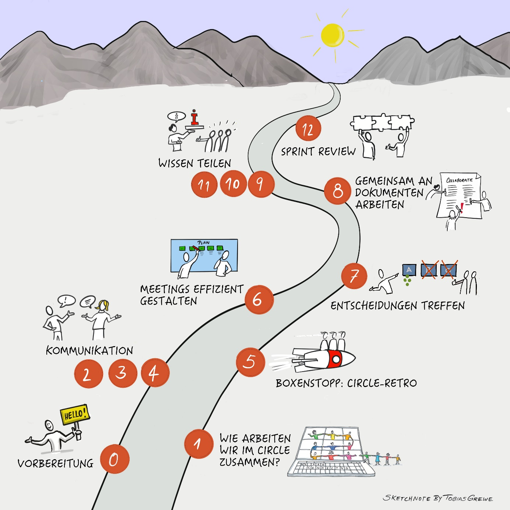

## Deine Lernreise im Überblick
Dieser
Leitfaden ist in 12 Katas (Übungen) unterteilt. Wir empfehlen, diese in
gemeinsamen Treffen (Meetings) zu bearbeiten. Der einfachste Weg, die
Lernreise zu durchlaufen, ist über einen Zeitraum von 12 Wochen mit
einer Kata und einem Treffen pro Woche. Natürlich können die 12 Katas
auch frei verwendet werden, wenn dieser Zeitrahmen nicht passt.

In der Grafik findest du die empfohlene Reihenfolge der Lernreise.
Natürlich kann die Reihenfolge der Themen auch frei gewählt werden.

- Im Vorbereitungstreffen (Schritt 0) geht es darum, die Lernreise
  vorbereiten, sich klar zu werden über die eigene Motivation und mit
  der Lerngruppe zu verabreden, wie ihr euch in der Zeit organisieren
  wollt.

- In der ersten Kata führen wir euch in das Collaboration Canvas ein und
  legen den Grundstein für eure Zusammenarbeit in eurem Kreis.

- In den Katas 2-4 geht es um verschiedene Aspekte rund um das Thema
  Kommunikation. Du lernst geeignete Tools aber auch Kanäle für die
  Kommunikation kennen und erfährst, wie du deine Kommunikation optimal
  ausrichtest.

- In Kata 5 erfolgt ein Boxenstopp, in dem ihr eine Circle-Retrospektive
  durchführt.

- In Kata 6 erhältst du Anregungen, wie du Meetings effizient gestalten
  kannst.

- Das Thema der Kata 7 ist "Entscheidungen treffen" und wie dies
  digital geschehen kann.

- In Kata 8 steht das gemeinsame Arbeiten an Dokumenten im Mittelpunkt.
  Du lernst, was dabei in der digitalen Zusammenarbeit zu
  berücksichtigen ist.

- In den Katas 9-11 liegt der Schwerpunkt auf Wissen teilen. Du
  behandelst dabei die Aspekte Wissen "finden", "wertschätzen" und
  "teilen".

- In Kata 12 erwartet dich ein Sprint-Review. Hier reflektierst du deine
  Lernreise.

### Kurze Anleitung zur Reiseplanung

Jeder Schritt auf der Lernreise braucht

- Vorbereitung (in Einzelarbeit)

und dann ein Treffen mit einer Agenda (im Circle / Gruppenarbeit) mit
folgendem Aufbau:

- Check-in

- Hauptthema

- Check-out

Für das Treffen in der Gruppe bereitest du jeweils eine Übung vor, die
wir Kata nennen, so dass ihr euch gemeinsam darüber im Circle / in der
Arbeitsgruppe austauschen könnt.

### Zeitplanung

Bitte plane pro Lerneinheit mindestens 2 Stunden Zeit ein: 1 Stunde
(oder mehr) für deine Kata und 1 Stunde für das anschließende gemeinsame
Treffen in der Gruppe. Vor- und Nachbereitungszeiten können dabei
variieren.

Digitale Zusammenarbeit ist ein sehr umfangreiches Thema. Es können
nicht alle Aspekte gleichermaßen erarbeitet werden. Auch ist euer
Kenntnisstand jeweils unterschiedlich in den einzelnen Bereichen.

Bitte lege für dich deine Schwerpunkte fest und entscheide bei jeder
Kata, ob du zusätzlich zum Lernpfad noch mehr machen willst - es gibt in
jeder Kata weiterführende Tipps und Aufgaben für dich.

**Und nun: viel Spaß bei der Reise!**
