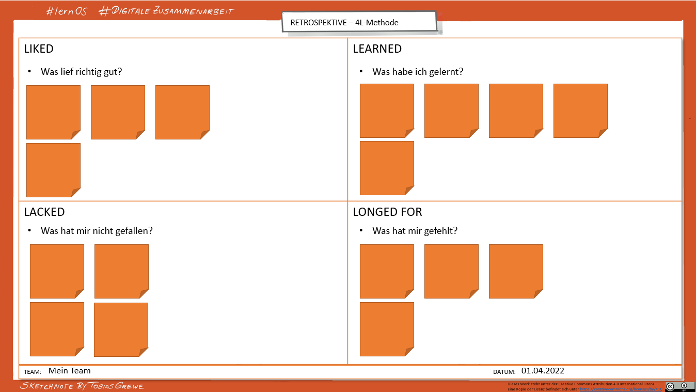

##  Kata 5 - Boxenstopp: Circle-Retro

Schaut doch als Circle, als Gruppe, gemeinsam nochmal zurück.

Retrospektiven sind eine Möglichkeit, aus unseren Erfahrungen zu lernen
und uns zu verbessern. Sie helfen uns, zu reflektieren, was gut gelaufen
ist, was schiefgelaufen ist und was wir anders machen können.

In dieser Kata wirst du erkunden, warum Retrospektiven wichtig sind, wie
du sie durchführen könntest und welche Vorteile sie für dich und deine
Teams haben.

Macht dann heute eine Retrospektive zu eurer bisherigen Zusammenarbeit
in diesem Circle.

Wie ist es euch damit ergangen? Was wollt ihr weglassen? Wovon wünscht
ihr euch mehr?

#### Vorbereitung (Einzelarbeit)

- Lese die "Kata - Retrospektive", mache die Übungen.
> Tipp: Den Aufgabentext für die Kata findest du immer nach der Agenda.

#### Agenda (Circle/Gruppenarbeit)

- **Check-in:** *(10 Minuten)* 
  Was hat dich die letzte Woche im Zusammenhang mit digitaler
  Zusammenarbeit beschäftigt? 
  Zwei-Minuten-Timebox pro Circle-Mitglied.
  
- **Hauptthema**: *(45 Minuten)* 
  Stellt euch gegenseitig eure Ergebnisse und Erkenntnisse aus der
  „Kata - Retrospektive" vor und tauscht euch darüber aus. 
   
  Welche Retro-Vorlage wollt ihr nutzen um den Circle-Boxenstopp
  durchzuführen?
  (Für den Fall, dass ihr euch nicht entscheiden könnt, versucht es
  einfach mit dieser:
  [Vorlage Template 4L](6-01-Vorlagen.md))  
  Anhand derer **reflektiert ihr gemeinsam, wie eure bisherige
  Zusammenarbeit im Circle gelaufen ist**.

     - Schreibt zunächst eure Punkte auf (z.B. Stichpunktartig auf Post-its),
       danach sprecht ihr darüber und versucht euch gegenseitig zu verstehen
       und - wenn ihr Zeit dafür habt - ggf. Lösungen zu finden.
  
     - Überlegt gemeinsam, ob Regeln im Canvas angepasst oder erweitert
       werden sollten, erweitert falls nötig den [Collaboration Canvas](6-01-Vorlagen.md) mit euren
       neuen Erkenntnissen und formuliert eure gemeinsamen Regeln der
       Zusammenarbeit.

- **Check-out:** *(5 Minuten)*  
  Was wirst du bis zum nächsten Treffen tun?

#### Kata - Retrospektive

In dieser Kata lernst du die Möglichkeiten von rückblickendem
Erfahrungsaustausch kennen. Du wirst auch als erstes einen Überblick
verschaffen und in der nächsten Session gemeinsam in deinem Circle,
deiner Gruppe, eine Retrospektive ausprobieren.

Anwenden könnest du das Format der Retrospektive (kurz: Retro) später
dann beispielsweise

um diese in Projektgruppen oder zur Auswertung von gemeinsamen Prozessen
oder Veranstaltungen einzusetzen. Retrospektiven werden in der agilen
Vorgehensweise angewandt.

- Schau dir die verschiedenen Tools und Vorlagen an und besprich es mit
  deinen Circle beim nächsten Treffen. Wenn du schon mal von Retro
  gehört hast, kannst du direkt zum Übungsteil übergehen, falls du dich
  aber noch ein bisschen erkundigen möchtest, was sich hinter eine Retro
  verbirgt und was Retrospektive bedeutet, dann schau dir die [Theorie
  "Retrospektive"](5-03-Theorie-Retrospektive.md) an.

- Beispiel für eine Retro:

  **4L Methode**:

  Du findest eine PowerPoint-Vorlage hierzu unter
[Vorlagen](6-01-Vorlagen.md).

 - Templates bzw. Vorlagen nutzen:
     - Mural <https://www.mural.co/templates/retrospective>
     - Miro
    [https://miro.com/templates/retrospective-tool/](https://miro.com/templates/retrospective-tool/%20)
    und <https://miro.com/templates/4-ls-retrospective/>
     - Trello <https://trello.com/b/hkaQsLWx/sprint-retrospectives>

  - Weiterführendes Material:
      - <https://retromat.org/de/>
      - <https://retromat.org/blog/best-retrospective-for-beginners/>
      - <https://liberatingstructures.de/liberating-structures-menue/15-solutions/>

- Anleitungen:
    - Retrospektive
    <https://www.atlassian.com/de/team-playbook/plays/retrospective>
    - 4L-Retrospektive
    <https://www.atlassian.com/de/team-playbook/plays/4-ls-retrospective-technique>
    - Starfish-Methode
    https://t2informatik.de/wissen-kompakt/starfish-retrospektive/

- Beispiele:
    - <https://www.collaboard.app/de/blog/retrospective-online-whiteboard>
    - <https://agilescrumgroup.de/retrospektive-formen-mit-beispielen-und-ideen/>

- Such dir eine der oben erkundeten Vorlagen aus und mach anhand dieser
  Retrospektive einen Circle-Boxenstopp. Reflektiere gemeinsam mit
  deinen Circle, wie eure bisherige Zusammenarbeit gelaufen ist, was ihr
  auf jeden Fall beibehalten und was ihr weglassen wollt. Mach dir dazu
  jetzt Gedanken, so dass ihr beim nächsten Treffen zeitnah loslegen
  könnt.

#### Wenn du mehr machen willst: 

- Wenn du schon die Retro innerhalb der Lernreise ausprobiert hast,
  könnest du dir im nächsten Schritt daran wagen, diese mal im eigenen
  Team oder einer anderen Gruppe auszuprobieren.

