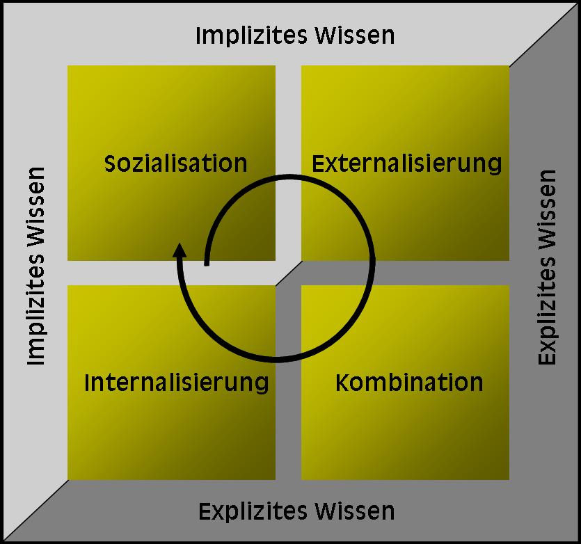

## Theorie: Wissen - Finden - Wertschätzen - Teilen

### Wissensmanagement: Eine Lernreise durch vier Reifegrade

Jakob Nielsen hat 2006 die "90-9-1"-Faustregel für Online-Communities
aufgestellt, nach der "in den meisten Communities 90 % der Benutzenden
"Lurker" sind (die still mitlesen aber niemals etwas beitragen), 9 %
gelegentlich Kommentare posten, und nur 1 % der Mitglieder für fast alle
Aktivitäten (Erstellung von Inhalten) verantwortlich sind."

Auch wenn die plakativen Prozentzahlen schon damals umstritten waren
(und heute überholt sind -- aktuelle Forschungen weisen eher in Richtung
einer 70-20-10 Verteilung), so lassen sich diese Aktivitäten-Level auch
als Reifegrade für die Arbeit mit Wissen interpretieren, in der sich
Menschen auf eine Lernreise durch vier Stufen begeben:

**Level 1: Suchen und Finden**

- Auf der ersten Stufe steht die Suche nach vorhandenem Wissen im
  Vordergrund: die still Mitlesenden greifen auf vorhandene Dokumente,
  Handbücher und interne Ressourcen zu und fokussieren auf die
  effiziente Nutzung von Suchmaschinen, Datenbanken oder
  Diskussionsforen, um relevantes Wissen zu erschließen.

**Level 2: Interaktion mit Wissensgebenden**

- Auf dieser Stufe beginnt die Interaktion mit den Wissensgebenden durch
  Likes und Kommentare: User können so ihre Wertschätzung für das
  gefundene Wissen ausdrücken und durch die aktive Teilnahme an
  Diskussionen in den Austausch mit den Expert:innen treten.

**Level 3: Proaktives Teilen des eigenen Wissens**

- Wissensgebende werden durch das proaktive Verfassen eigener Beiträge
  mit ihrer Expertise sichtbar in den Netzwerken. Durch das Teilen ihrer
  Erfahrungen oder die Präsentation von Inhalten in Vorträgen und
  Workshops liefern sie neue wichtige Inhalte, die von anderen gelesen
  oder kommentiert werden können.

**Level 4: Kuratieren von Wissenssammlungen**

- Wenn Fach-Expert:innen nicht nur eigenes Wissen teilen, sondern das
  relevante Wissen in ihren Fachgebieten sammeln, auswählen, bewerten
  und kommentieren, tragen sie mit dieser redaktionellen Arbeit zum
  Aufbau einer umfassenden und qualitativ hochwertigen Wissensbasis bei,
  die für die gesamte Organisation / Community von großem Wert ist.  
  (Hinweis: für das Kuratieren von Wissenssammlungen gibt es einen
  eigenen lernOS-Leitfaden:
  <https://cogneon.github.io/lernos-content-curation/de/>)

### Wissensmanagement im Wandel - von „WM 1.0" zu „Enterprise 2.0" 

Die Entwicklung des Wissensmanagements lässt sich grob in zwei Phasen
unterteilen:

**WM 1.0: Dokumenten-Management (ab Mitte der 90er Jahre)**

In dieser Phase lag der Fokus darauf, explizites Wissen in Form von
Dokumenten zu sammeln und zu verwalten. Organisationen setzten auf
Datenbanken, um Informationen systematisch zu speichern und zugänglich
zu machen. Wichtige Ziele des WM waren die Sicherung der Qualität und
die einfache Auffindbarkeit und Wiederverwendung der gespeicherten
Informationen.

**Enterprise 2.0: Beginn der digitalen Zusammenarbeit (ab 2006)**

Mit dem Aufkommen sozialer Netzwerke und digitaler Kollaborationstools
verlagerte sich der Schwerpunkt auf das implizite Wissen und die
Erfahrungen der Mitarbeitenden. Der Wissensaustausch erfolgte zunehmend
durch die Interaktion in Netzwerken wie z.B. Communities of Practice.

|                       | **"WM 1.0" - Dokumenten-Management**         | **Enterprise 2.0 - Beginn der Digitalen Zusammenarbeit**    |
|-----------------------|----------------------|------------------------|
| Zeitraum              | ab Mitte der 90er    | ab 2006                |
| Perspektive           | Organisations-Wissen steckt in Dokumenten | Organisations-Wissen steckt in den Köpfen der Expert:innen  |
|WM-Fokus               | Information & Dokumente / **Explizites** Wissen       | Erfahrungen & Dialog,Zusammenarbeit / **Implizites** Wissen |
|Aufgaben               | Dokumente sammeln - Speichern - Qualität sichern | Netzwerken - Dialog moderieren - Wissensträger:innen coachen    |
|Werkzeuge              | Datenbanken          | Soziale Netzwerke, Communities of Practice    |

#### Wissensarten  

##### Implizites vs. Explizites Wissen

**Implizites Wissen** ist individuell und persönlich, kontextspezifisch
und schwer in Worte zu fassen. Das „Wissen in den Köpfen" umfasst
Fähigkeiten, Erfahrungen und Einsichten, die Menschen intuitiv besitzen.

- Implizites Wissen ist wie das Fahren eines Fahrrads -- man erlernt es
  durch Üben („Learning by Doing") und es ist schwierig, z.B. in einem
  Handbuch präzise zu beschreiben, wie man das Gleichgewicht hält.

- Ein Beispiel für implizites Wissen in Organisationen ist das Know-how
  eines erfahrenen Mitarbeiters, der eine mechanische Werkzeugmaschine
  einstellen und bedienen kann -- solche Erfahrungen werden in der
  täglichen Arbeit auf natürliche Weise gelernt.

- Die Weitergabe und das Teilen von implizitem Wissen erfolgen im
  direkten Austausch zwischen Menschen, im Dialog oder durch Beobachten
  von Handlungen.

**Explizites Wissen** hingegen ist formalisiert, systematisch und leicht
zu teilen und zu verbreiten. Es kann in Dokumenten, Handbüchern oder
Datenbanken festgehalten und von anderen genutzt werden.

- Explizites Wissen ist wie ein Rezept in einem Kochbuch -- es ist
  eindeutig formuliert und die klaren Anweisungen können von anderen
  leicht nachvollzogen werden.

- Beispiele für explizites Wissen in Organisationen sind ein
  Unternehmenshandbuch, das zu beachtende Verfahrensweisen und
  Richtlinien klar beschreibt, oder eine Best-Practice- Sammlung, die
  effektive Arbeitsmethoden in einem Dokument zusammenfasst.

Einige Quellen bezeichnen stillschweigendes Wissen auch als etwas
anderes als implizites und explizites Wissen. Zum Beispiel:
<https://bloomfire.com/blog/implicit-tacit-explicit-knowledge/> Der
Einfachheit halber haben wir hier stillschweigendes und implizites
Wissen zusammengefasst, aber fühl dich frei, diese Konzepte selbst
weiter zu erkunden.

##### Individuelles vs. Kollektives Wissen

**Individuelles Wissen** ist an einzelne Personen gebunden. Es ist
subjektiv, basiert auf persönlichen Erfahrungen und ist vor allem
implizit -- also nicht für andere sichtbar oder leicht zu teilen.

**Kollektives Wissen** hingegen ist das gesamte Wissen einer
Organisation. Es entsteht, wenn das Wissen von Einzelpersonen in der
Organisation geteilt, kombiniert und institutionalisiert wird.

Das Wissensmanagement als Disziplin befasst sich mit dem Aufbau und der
Pflege des kollektiven Wissens, was für Organisationen aus mehreren
Gründen wichtig ist:

- **Wissensbewahrung**: Individuelles, implizites Wissen wird z.B. durch
  Dokumentation zu explizitem Wissen, das auch erhalten bleibt, wenn
  Mitarbeitende die Organisation verlassen.

- **Effizienzsteigerung**: Kollektives Wissen ermöglicht es neuen und
  bestehenden Mitarbeitern, auf vorhandene Erfahrungen und Ressourcen
  zurückzugreifen, was Zeit spart, und Fehler vermeidet.

- **Innovation**: Aus dem Austausch von individuellem Wissen können neue
  Ideen und Verbesserungen entstehen.

- **Entscheidungsfindung**: Kollektives Wissen bietet eine breitere
  Wissensbasis für Entscheidungen und kann so zu fundierteren und
  ausgewogeneren Ergebnissen führen.

##### Die Wissensspirale (SECI-Modell) von Nonaka und Takeuchi (1995)

Das SECI-Modell der japanischen Wissenschaftler Nonaka und Takeuchi,
auch bekannt als Wissensspirale, ist ein dynamisches Modell für den
Wissenstransfer und die Wissensentstehung in Organisationen, das den
Übergang von individuellem zu kollektivem Wissen und die Umwandlung von
implizitem in explizites Wissen und umgekehrt als stetigen
Transformationsprozess beschreibt.

Die englische Abkürzung **SECI** steht für die 4 Phasen dieses
zyklischen Prozesses:

1.  **Sozialisation** (von implizitem zu implizitem Wissen): In dieser
    Phase wird Wissen durch direkten Erfahrungsaustausch und Beobachtung
    übertragen -- das kann auch ohne formale Sprache geschehen.

2.  **Externalisierung** (von implizitem zu explizitem Wissen): Hier
    wird das implizite Wissen artikuliert und in explizite Formen wie
    Dokumente oder gesprochene Worte umgewandelt. Durch diesen Schritt
    der Dokumentation und Verarbeitung wird neues Wissen geschaffen.

3.  **Kombination** (von explizitem zu explizitem Wissen): In dieser
    Phase wird explizites Wissen aus verschiedenen Quellen
    zusammengeführt, organisiert und systematisiert, um umfassendere
    Wissensspeicher zu bilden.

4.  **Internalisierung** (von explizitem zu implizitem Wissen):
    Schließlich wird das gesammelte explizite Wissen den Mitarbeitenden
    zugänglich gemacht und durch Anwendung und Praxis verinnerlicht und
    so in (neues) implizites Wissen umgewandelt, wodurch es Teil der
    individuellen Wissensbasis wird.

> Grafik: Wissensspirale nach Nonaka und Takeuchi  
> (Quelle: <https://de.wikipedia.org/w/index.php?curid=1267015>)

Quellen:

- Nonaka, I., & Takeuchi, H. (1995). The Knowledge-Creating Company: How
  Japanese Companies Create the Dynamics of Innovation. Oxford
  University Press.

- <https://de.wikipedia.org/wiki/SECI-Modell>

- SECI-Modell: Die Wissensspirale nach Nonaka und Takeuchi:
  <https://blog.hubspot.de/service/seci-modell>

- DIN SPEC 91443:2021 Systematisches Wissensmanagement für KMU --
  Instrumente und Verfahren\
  <https://www.dgq.de/fachbeitraege/din-iso-304012021-wissensmanagementsysteme-eine-einfuehrung/>

### Wissen - Formate

Wissen kann auf ganz unterschiedlichen Wegen kommuniziert und mit
anderen geteilt werden: wir reden mit anderen Menschen, lesen einen
Blog, oder kommentieren ein Video auf einer Online-Plattform. Die
Formate lassen sich nach folgenden Kriterien beschreiben:

- Gespräch: persönlicher Austausch / Telefon- oder Videokonferenz /
  Schulung

  - Hohe Interaktion / synchron in Echtzeit

  - Keine Skalierbarkeit -- nur die Teilnehmenden

  - Implizites Wissen -- wird in der Regel nicht dokumentiert  
    (Ton- und Videoaufzeichnung sind prinzipiell möglich, vor allem bei
    Online-Formaten)

- Handschriftliche Notiz: Block und Stift, Post-It, Flipchart,
  Sketchnote

  - Mittlere Interaktion bei synchroner Aktivität, z.B. an Flipcharts  
    Niedrige Interaktion asynchron (bei Notizen und Mitschriften)

  - Explizit, aber Ad hoc-Dokumentation ohne impliziten Kontext oft kaum
    nutzbar

  - Geringe Skalierbarkeit -- Nutzung nur im kleinen Kreis möglich

- Elektronisches Dokument / Datei: Office-Dateien, E-Mail, Digitale
  Notizbücher, Mindmaps

  - Hohe Skalierbarkeit -- können beliebig geteilt und vervielfältigt
    werden

  - Asynchron / niedrige bis mittlere Interaktion (Interaktionsgrad und
    Synchronizität erhöhen sich durch die Möglichkeiten zum gemeinsamen
    Bearbeiten der Dokumente)

  - Explizit -- Dokumentation zur Zweck der Weitergabe von Informationen
    und Wissen

- Online-Beiträge (Blog, Communities, Foren, Wiki)

  - Beiträge auf Online-Plattformen können prinzipiell als Teilmenge der
    elektronischen Dokumente betrachtet werden:

  - Hohe Skalierbarkeit / explizit

  - Höhere Interaktion als konkretes Ziel von Beiträgen -- wird z.B.
    durch direkte Ansprache und Fragen angestrebt

  - Asynchron als Normalfall

- Listen (Linksammlungen, kuratierte Listen)

  - Skalierbar / Asynchron -- Spezialfall der elektronischen Dokumente

  - Explizit -- Expertenwissen fließt in Auswahl und Bewertung der
    verlinkten Quellen ein

  - Geringe Interaktion -- vor allem für Mitlesende zum Einstieg in
    Wissensthemen gedacht / Kommentare als Hinweise für Ergänzungen oder
    Korrekturen

Die Aufzeichnung von synchronen Events wie Gesprächen oder analogen
Formaten wie handschriftlichen Notizen dient vor allem der
Skalierbarkeit und der asynchronen Nutzbarkeit, weil die Medien über
digitale Kanäle geteilt werden oder von anderen konsumiert werden
können, die nicht live dabei waren:

- Bilder -- Screenshot, Foto von Flipcharts, Graphik

- Video -- Aufzeichnung von Live-Diskussionen und Vorträgen / Screencast
  mit PowerPoint

- Audio -- Podcast, Recording mit dem Smartphone

### Wissenstreppe

Die **Wissenstreppe von Prof. Klaus North** erläutert anschaulich, wie
Daten, Informationen und Wissen sowie schließlich Können, Handeln und
Kompetenz zusammenhängen bzw. aufeinander aufbauen. Sie setzt dies in
Beziehung zu einem Modell für operatives Wissensmanagement -- quasi
bottom-up ausgehend von dem Management der Daten und Informationen --
und strategischem Wissensmanagement, das quasi top-down eine Sichtweise
ausgehend von der Kompetenz und damit der Wettbewerbsfähigkeit als Ziel
nimmt.

Mehr dazu hier:  
<https://wissensmanagement.open-academy.com/category/grundlagen/wissensmanagement-modelle/wissenstreppe>

In diesem Video erläutert Dr. Angelika Mittelmann die Wissenstreppe
anhand eines „echten" Modells: [Die
Wissenstreppe](https://youtu.be/zyYsHe1AaKU)

**Das Wissensmanagement-Modell nach Probst, Raub und Romhardt
(1999)**

Probst et al. haben einen systematischen Ansatz zur Verwaltung von
Wissen in Organisationen entwickelt, welcher sechs Kernprozesse umfasst,
die aufeinander aufbauen und zusammenwirken, um den effektiven Umgang
mit Wissen zu gewährleisten.

Das Modell hat eine breite Akzeptanz und Verbreitung gefunden, weil es
einen klar strukturierten und ganzheitlichen Ansatz bietet. Es deckt
alle relevanten Aspekte des Wissensmanagements ab und ist gleichzeitig
flexibel genug, um in verschiedenen organisatorischen Kontexten
angewendet zu werden. Darüber hinaus betont das Modell die Integration
von Wissensprozessen in die täglichen Arbeitsabläufe und die
strategische Ausrichtung des Wissensmanagements an den
Unternehmenszielen, was seine praktische Relevanz und Anwendbarkeit
erhöht.

**Wissensidentifikation:**

Dieser Prozess befasst sich mit der Ermittlung und Bewertung des
vorhandenen Wissens in einer Organisation: Welche Arten von Wissen sind
vorhanden? Wo befinden sie sich, und wie können sie genutzt werden? Die
Wissensidentifikation hilft dabei, Wissenslücken zu erkennen und zu
verstehen, welches Wissen für die Organisation besonders wertvoll ist.
Zur Unterstützung dieses Prozesses werden häufig Methoden wie
Wissenslandkarten und Kompetenzmatrizen eingesetzt.

**Wissensakquisition:**

Sobald Wissenslücken identifiziert wurden, zielt die Wissensakquisition
darauf ab, dieses fehlende Wissen aus **externen** Quellen zu erwerben.
Dies kann durch Schulungen, Rekrutierung von Experten, Kooperationen mit
anderen Unternehmen oder Forschungseinrichtungen und durch das
Hinzufügen neuer Wissensquellen wie Fachliteratur oder Datenbanken
geschehen. Die Akquisition von Wissen stellt sicher, dass die
Organisation Zugang zu den notwendigen Informationen und Fähigkeiten
hat, um ihre Ziele zu erreichen.

**Wissensentwicklung:**

Im Gegensatz zur Akquisition konzentriert sich dieser Prozess auf die
Schaffung neuen Wissens **innerhalb** der Organisation.
Innovationsprojekte, Forschungs- und Entwicklungsabteilungen sowie Lern-
und Weiterbildungsprogramme spielen hierbei eine zentrale Rolle. Die
Wissensentwicklung ist entscheidend, um die Wettbewerbsfähigkeit zu
steigern und kontinuierliche Verbesserungen zu fördern. Formate für den
Erfahrungsaustausch wie Communities of Practice oder Modelle wie das
SECI-Modell (s. oben) unterstützen die interne Wissensentwicklung.

**Wissensverteilung:**

Nach der Identifikation und Bereitstellung von Wissen ist es wichtig,
dieses Wissen in der gesamten Organisation zu verteilen. Die
Wissensverteilung stellt sicher, dass alle relevanten Mitarbeitenden
Zugang zu dem Wissen haben, das sie für ihre Arbeit benötigen. Hierbei
kommen verschiedene Kommunikationskanäle zum Einsatz, wie Intranet,
Wissensdatenbanken, Schulungen und informelle Netzwerke. Eine effektive
Wissensverteilung verhindert das Entstehen von Wissenssilos und fördert
den Austausch und die Zusammenarbeit

**Wissensnutzung:**

Dieser Prozess bezieht sich auf die effektive Anwendung des verfügbaren
Wissens. Es geht darum, dass Mitarbeiter das Wissen in ihrer täglichen
Arbeit einsetzen, um ihre Aufgaben effizienter zu erfüllen und bessere
Entscheidungen zu treffen. Wissensnutzung wird durch eine unterstützende
Unternehmenskultur und geeignete Anreizsysteme gefördert. Es ist
wichtig, dass das Wissen nicht nur vorhanden ist, sondern auch aktiv
genutzt wird, um den größtmöglichen Nutzen für die Organisation zu
erzielen.

**Wissensbewahrung:**

Schließlich umfasst die Wissensbewahrung den Erhalt und die Sicherung
von Wissen, damit es auch in Zukunft verfügbar bleibt. Dies ist
besonders wichtig in Situationen, in denen erfahrene Mitarbeiter die
Organisation verlassen oder wenn es darum geht, wertvolle Informationen
aus Projekten und Prozessen zu dokumentieren. Techniken wie
Wissensdatenbanken, Dokumentationssysteme und systematische Archivierung
spielen eine zentrale Rolle in der Wissensbewahrung.

Quellen:

- Probst, G., Raub, S., & Romhardt, K. (1999). Wissen managen: Wie
  Unternehmen ihre wertvollste Ressource optimal nutzen. Gabler Verlag.

### Feedback geben

Feedback kann neutral, positiv (Lob) und negativ (Kritik) sein.

Ziel sollte dabei immer sein das Feedback konkret, sachlich, respektvoll
und konstruktiv zu formulieren. Emotionalität kann vor allem im
positivem Feedback auch als Verstärkung genutzt werden. Ein "Finde ich
super" wird dem Gegenüber bestimmt Freude bereiten. Aber Achtung - ein
"Das ist doch totaler Blödsinn" kann dagegen dazu führen, dass die
angesprochene Person sich zurückzieht und ihre Informationen fortan
nicht mehr teilen möchte (und andere Personen, die mitlesen auch
abgeschreckt werden).

Im Unternehmensumfeld ist es oft am leichtesten über digitale Wege (z.B. Antwort per E-Mail oder Chat) Feedback zu geteiltem Wissen zu geben
und so auch seine Dankbarkeit zu zeigen. Natürlich kann man die
Kolleg:innen, die ihr Wissen geteilt haben auch persönlich ansprechen -
durch die öffentliche Reaktion z. B. in Communities oder ESN unterstützt
man jedoch den öffentlichen direkten Austausch und motiviert auch andere
zu reagieren und schlussendlich dann auch den Mut zu fassen ihr Wissen
auch selbst zu teilen. Weitere Vorteile:

Öffentliches "Liken" bietet die Möglichkeit, mit minimalem Aufwand,
maximalen Impact zu erzielen:

- Eine Meinung oder Aussage, deren Zeit gekommen ist... wird durch
  x-fache Likes schnell sichtbar

- Potenziell kann ein Like einer Person mit einem großen Netzwerk
  „beliebig" viel Wirkung erzielen. Wenn zum Beispiel eine
  Führungskraft, gezielt liked, werden so ggf. mehr Mitarbeiter:innen
  auf ein Thema aufmerksam.

- Eine Umfrage an 1000 Mitarbeiter ist mit Aufwand verbunden sowohl bei
  der Vorbereitung als auch bei der Beantwortung und Rücksendung. Ein
  Beitrag in einer großen Chat Community kann durchaus schnell 1000
  Reaktionen erreichen und kann von jedem in wenigen Sekunden erfasst
  werden.

Quellen:

<https://harald-schirmer.de/2019/04/07/likes-sind-mehr-als-wertschaetzung/>

<https://www.honestly.de/blog/konstruktives-feedback-10-goldene-regeln/>

### Sichtbar werden - "Working out Loud" (WOL)

Der Begriff "*Working out loud"* wurde von Bryce Williams und John Stepper 2010 geprägt. Der Gedanke dahinter: Das eigene Wissen und die eigene Arbeit sichtbar machen, damit alle davon profitieren können. Es geht also um eine Änderung des Mindsets und um wertschätzende und transparente Zusammenarbeit über Abteilungs-, Länder-, Unternehmensgrenzen hinweg.

Im Kontext zu Working out loud sind zahlreiche kostenlose Anleitungen
und Aufgabenstellungen ("Circle Guides") entstanden.

#### Die 5 Prinzipien hinter Working out Loud

#### Relationships

Durch den Aufbau eines sozialen Netzwerks entstehen Beziehungen, die
beruflich und privat für beide Seiten hilfreich sind. Diese Beziehungen
werden konsequent gepflegt und ausgebaut.

#### Generosity

Echte Großzügigkeit erwartet keine Gegenleistung. Nach diesem Prinzip
werden Wissen und Informationen geteilt, Feedback wird angeboten und
wertvolle Tipps werden geliefert. In der Praxis kann das z.B. auch durch
konkrete Unterstützung bei Projekten geschehen.

#### Visible Work

Dies bedeutet, seine Arbeit sichtbar zu machen, zu zeigen, woran man
gerade arbeitet und welche Zwischenergebnisse es schon gibt. Von diesen
Erkenntnissen können andere profitieren, Doppelarbeit und Fehler werden
vermieden, weil man auf den Erfahrungen anderer aufbauen kann.

#### Purposeful discovery

Jeder verfolgt sein individuelles Lernziel und orientiert sich bei
seinen Aktivitäten daran. Aber auch außerhalb der Circle geht es darum,
fokussiert an Zielen zu arbeiten und diese diszipliniert zu verfolgen.

#### A Growth Mindset

Zum einen helfen das Feedback und das Know-how der anderen, sich
kontinuierlich zu verbessern. Zum anderen lernt man, Sichtweisen anderer
zu schätzen, seine eigene Komfortzone zu verlassen bzw. zu erweitern und
Veränderungen als Chance zu begreifen. Menschen mit einem Growth Mindset
sind neugierig auf und offen für alles, was die Arbeitswelt und das
Leben bereithalten.

Quelles:
<https://www.projektmagazin.de/artikel/working-out-loud-bessere-zusammenarbeit>,
<https://www.workingoutloud.com/>

Im Rahmen von lernOS werden die Themen aus Working Out Loud im Leitfaden
"lernOS für Dich" im Lernpfad Offenheit & Vernetzung behandelt.

**Wenn du mehr über diese Themen wissen möchtest:**

- [Überblick - lernOS für Dich Leitfaden
(cogneon.github.io)](https://cogneon.github.io/lernos-for-you/de/2-3-0-Lernpfad-OV/)

- <https://de.wikipedia.org/wiki/Wissensmanagement>

- <https://vonneuem.de/wissensmanagement-die-moderne-art-des-wissenstransfers/>

- <https://qaspire.com/5-elements-of-working-out-loud-by-johnstepper/>

- <https://de.wikipedia.org/wiki/Working_out_loud>

- [Archiv der WOL Guides im WOL.wiki](https://wol.wiki/circle/guide/de)

