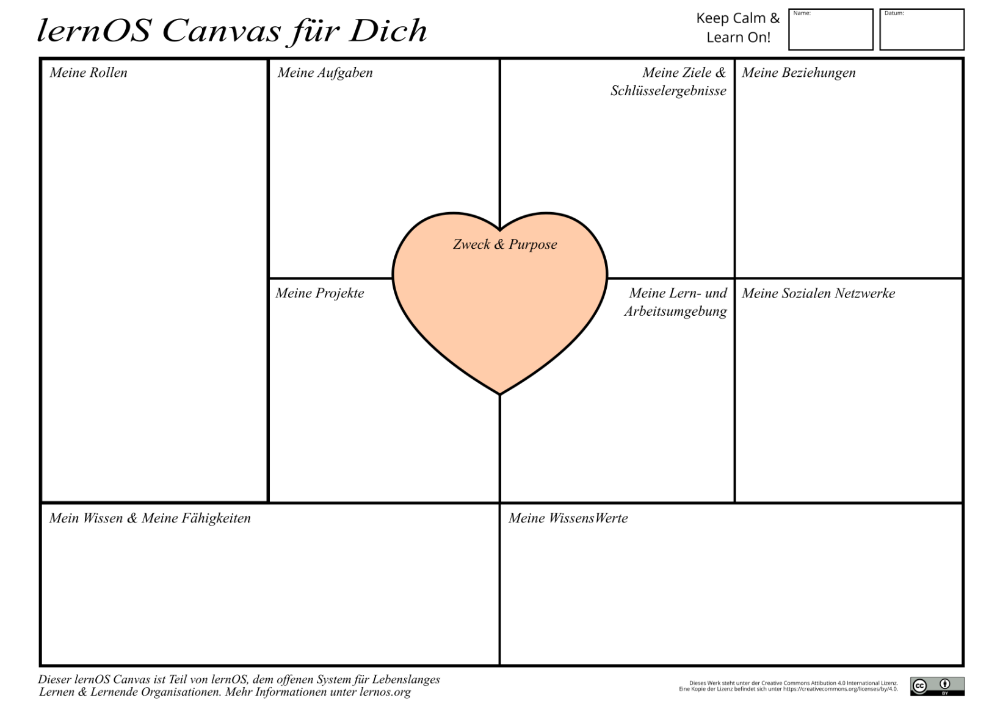
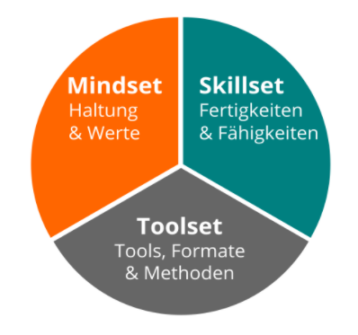

## Kata 1 - Meine Standort-Bestimmung

In dieser Übung beschäftigst du dich mit deiner persönlichen
Standortbestimmung in Bezug auf die digitale Zusammenarbeit. Das lernOS
Canvas zeigt nicht nur dir deinen Standort, sondern im Austausch mit den
anderen Circle-Mitgliedern könnt ihr sehen, wo jede:r von euch steht und
wie und wo ihr euch gegenseitig unterstützen könnt. Das lernOS-Wheel
gibt euch einen Überblick über die verwendeten Tools, dein Skill- und
Mindset.

### Mein lernOS-Canvas

-   Lade dir die Vorlage des [lernOS
    Canvas](https://cogneon.github.io/lernos-for-you/de/1-2-lernOS-Canvas/)
    herunter, welches in verschiedenen Formaten (z.B. PowerPoint, PDF,
    PNG) dort vorliegt. Oder alternativ kopiere dir die PowerPoint aus den [Vorlagen](7-0-Vorlagen.md).
-   Fülle das lernOS Canvas aus.  
-   Bitte lege dein persönliches lernOS Canvas am Ort ab, den ihr in der Woche 0 festgelegt habt.
  
    

 

### lernOS Workplace

In dieser Kata geht es darum deinen persönlichen Workplace zu erstellen
und dir die drei Dimensionen genauer anzuschauen. Für mehr schaue dir
den [lernOS-for-You Guide](https://cogneon.github.io/lernos-for-you/de/)
an.

In deinem persönlichen Entwicklungsprozess ist es wichtig, alle drei
Dimensionen des [lernOS Workplace](https://cogneon.github.io/lernos-for-you/de/1-4-lernOS-Workplace/)
zu kennen und zu berücksichtigen.

-   Mindset,
-   Skillset und
-   Toolset.

**Wo startest du (persönlich) mit dem Thema?**  

**Toolset:**  
Schreibe in deiner [Vorlage](7-0-Vorlagen.md)
auf, welche Tools du bereits kennst, sowohl aus dem privaten als auch
aus dem beruflichen Kontext.

**Skillset:**  
Was sind die Fähigkeiten, die du mitbringst?

**Mindset:**  
Überlege dir, welche Haltung du zum Thema digitale Zusammenarbeit
mitbringst und welche deiner Werte darauf ein zielen.

Bitte lege dein persönliches lernOS Workplace am Ort ab, den ihr in der
Woche 0 festgelegt habt.
