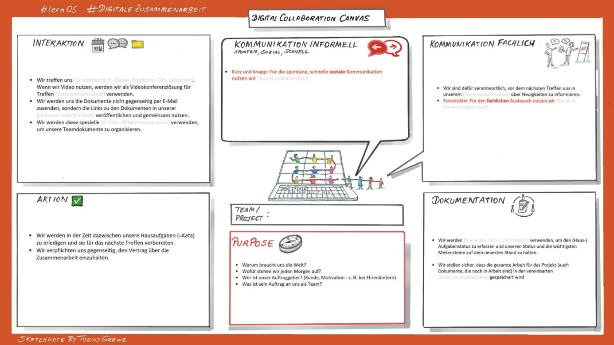

**Zusammenarbeit (Teil 1)**

## Kata 2 - Wie arbeiten **wir** zusammen?

**Lies dir zur Vorbereitung die Grundlagen durch:** [Grundlagen:
Zusammenarbeit](6-3-Theorie-Zusammenarbeit.md)

Zum Einstieg in den Bereich
"Zusammenarbeit" schau dir das [Collaboration Canvas](6-3-Theorie-Zusammenarbeit.md#collaboration-canvas) an.  
Nachdem du deine Standortbestimmung erstellt und mit den anderen geteilt
hast, geht es jetzt darum, euren gemeinsamen Workplace festzulegen.

Überlege, welche Vereinbarungen für die Zusammenarbeit du bereits in
deinem beruflichen Kontext kennst.  
Hast du welche? Wenn ja, welche sind dir wichtig und warum? Mache dir
dazu Notizen.

Überlege dir, wie ihr gerade im Circle zusammen arbeitet. Was passt bzw.
was passt nicht bezüglich eurer Vereinbarungen in Woche 0? Mache dir
dazu Gedanken, so dass ihr in der Woche 2 dann zusammen mit allen
Circle-Mitgliedern eure gemeinsamen Zusammenarbeitsregeln erstellen
könnt.

Verwendet im Circle-Treffen das [Collaboration Canvas](6-3-Theorie-Zusammenarbeit.md#collaboration-canvas) und
formuliert eure gemeinsamen Regeln der Zusammenarbeit.

### Wenn du mehr machen willst: 

Weiterführende Informationen findest du hier zusammengestellt: [Regeln
für die Zusammenarbeit](6-3-Theorie-Zusammenarbeit.md), Vertiefung und Idee zur
Umsetzung.

Als Anregung - nimm diese Regeln der Zusammenarbeit zum Anlass und
erarbeite mit deinem eigenen Team im beruflichen Kontext ein eigenes
[Collaboration Canvas](6-3-Theorie-Zusammenarbeit.md#collaboration-canvas).  
Nach einem Monat kannst du mit deinem Team dazu eine
[Retro](5-6-Kata-6.md) durchführen und teilt eure Erfahrungen.

