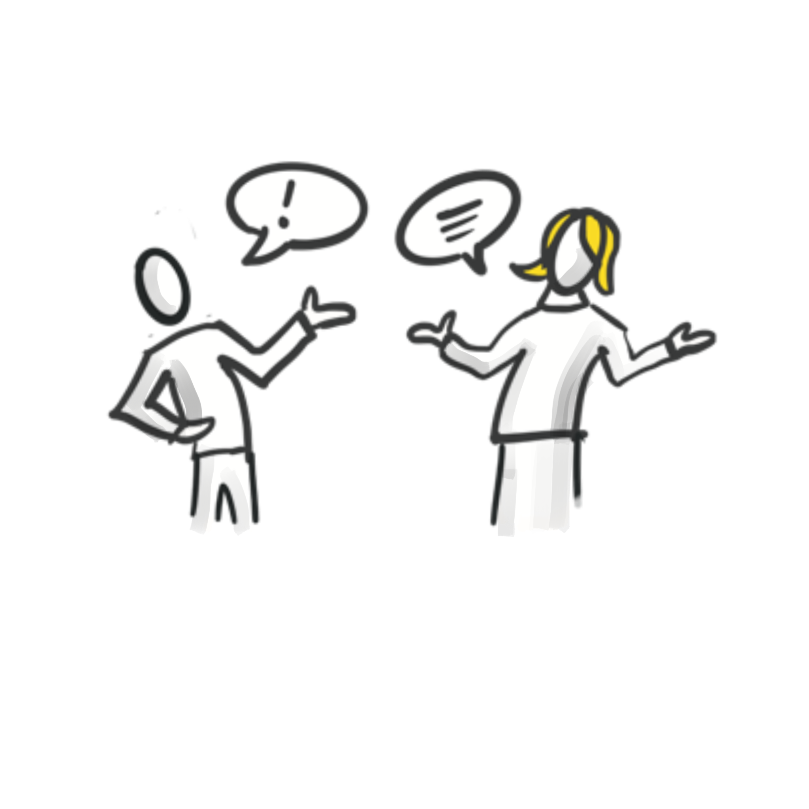

**Kommunikation**

## Kata 3 - Analysiere und reflektiere deine Kommunikation

### "Analysiere und reflektiere deine Kommunikation" (#KommunikationsKanäle)

Lese dir zur Vorbereitung die Grundlagen durch:

-   [Synchrone vs. Asynchrone Kommunikation](6-1-Theorie-Kommunikation.md#grundlagen-synchrone-asynchrone-kommunikation)
-   [Push vs. Pull Kommunikation](6-1-Theorie-Kommunikation.md#grundlagen-push-vs.-pull-kommunikation)

Welche Kommunikationskanäle nutzt du schon, welche kennst du noch (nutzt
sie aber nicht)?

Schaue durch deine Kommunikations-Kanäle!

1.  Welche Kommunikation läuft gut / welche erzeugt Stress?

2.  Schaue deine Kommunikations-Kanäle (z.B.
    E-Mail-Eingang/Chat-Nachrichten/o.ä.) durch:

    -   Welche Nachricht/Informationen kommen wo an?

    -   Wann/wie benötigst du die Informationen?

    -   Findest du die Informationen schnell/leicht wieder?

    -   Was nervt dich? z.B. Einladung zu Meeting ohne Agenda, CC-Mail
        an alle

    -   Was sind deine Bedürfnisse?

    -   Prüfe deinen Erwartungshorizont: Was hilft dir? Was kannst du
        ändern?

Tipp: Lass das sein, was dich genervt hat! ;-)

### Wenn du mehr machen willst: 

Lege eine Liste aller genutzten Kanäle an, so dass ihr dann im Circle
eine gemeinsame Liste erstellen könnt.
