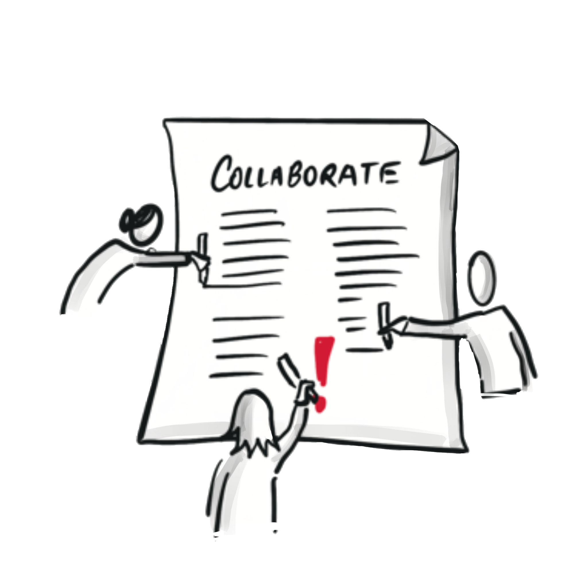

**Zusammenarbeit (Teil 2)**

## Kata 7 - Dokumente gemeinsam bearbeiten

Lese dir zur Vorbereitung die Grundlagen durch:  
[Theorie "Gemeinsam an Dokumenten arbeiten"](6-3-Theorie-Zusammenarbeit.md#gemeinsam-an-dokumenten-arbeiten)

Beantworte und reflektiere die folgenden Fragen:

-   Wo liegt euer Collaboration Canvas?
-   Wie hast du hier mitgearbeitet?
-   Wie hat die Zusammenarbeit funktioniert?
-   Hast du die Änderungen der anderen gesehen?
-   Wie hat sich das angefühlt, dass alle sofort gesehen haben, was du
    geschrieben hast?
-   Hat es Zeit für den Austausch gespart?
-   Soll das Dokument langfristig verfügbar und wieder auffindbar sein?
    Was musst du dafür tun?

Erstelle Beiträge für die gemeinsame Sammlung "die besten Hacks für die
digitale Zusammenarbeit" und lege sie in eine gemeinsame Datei.  
Die Frage ist: Wie schafft ihr das jetzt asynchron abzustimmen, welches
Tool ihr wählt und wo ihr die Datei ablegt?  
In [Wie teile ich Dokumente in einem Chat? (Beispiel M365)](6-3-Theorie-Zusammenarbeit.md#gemeinsam-an-dokumenten-arbeiten) findet ihr Inspirationen dazu.

Verwendet im Circle-Treffen eure gemeinsame Sammlung "die besten Hacks
für die digitale Zusammenarbeit" und überlegt euch eine gemeinsame
Struktur. Wie lief die asynchrone Zusammenarbeit?

### Wenn du mehr machen willst: 

Asynchron weiter zusammen arbeiten:

-   Du kannst die Liste in den nächsten Wochen erweitern, wenn dir
    weitere Hacks einfallen.
-   Du kannst Kommentare zu Hacks der anderen hinzufügen, z.B. wenn dir
    etwas besonders gefällt oder unklar ist.
-   Kannst du erkennen, wer welche Punkte ergänzt hat / Änderungen
    nachverfolgen?
-   Du kannst die Hacks mit deinem Netzwerk teilen. (siehe auch unter
    [Kata 10](5-10-Kata-10.md)))