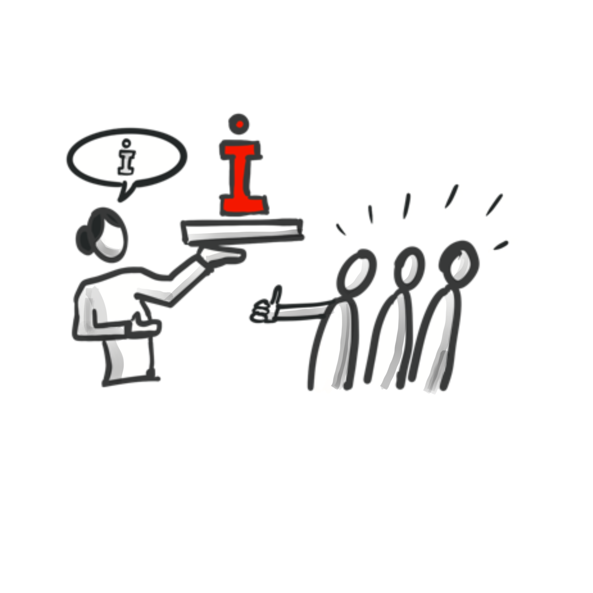

**Wissen teilen**

## Kata 9 - Wie kannst Du selbst vom Wissen anderer profitieren und Dankbarkeit zeigen (#Nehmen)?

Zum Einstieg in den Bereich "Wissen teilen" schau dir die
[Grundlagen](6-2-Theorie-Wissen-teilen.md) zu Wissensmanagement an.

[Beispiele für Wissen teilen: Arten und Formate](6-2-Theorie-Wissen-teilen.md#Beispiele-für-Wissen-teilen)
haben wir dir zusammengestellt.

-   Welche Beispiele für "Wissen teilen" kennst du aus deinem
    Arbeitsumfeld?
-   Gibt es noch weitere Formate, die du aus deinem privaten Bereich
    kennst?
-   Schreibe alle dir bekannten Formate und Arten auf.

Werde konkret für deinen beruflichen Kontext und wähle dir ein Thema
aus, das dich interessiert:

-   Wie und wo hast du dir Wissen bisher geholt oder von anderen
    bekommen?
-   Wie wurde das Wissen geteilt (Art, Format)?
-   Was ist dir dabei aufgefallen?

Und jetzt gehen wir einen Schritt weiter und wechseln die Perspektive:

-   Wann warst du zum letzten Mal richtig dankbar, als eine Kollegin
    oder ein Kollege etwas mit dir geteilt hat und du von ihrem bzw.
    seinem Wissen profitiert hast?
-   Wie zeigst du Dankbarkeit?
-   Was wurde durch dein "Danke sagen" ausgelöst?

Bezogen auf "Wie profitierst du vom Wissen anderer?" UND "Wie zeigst
du Dankbarkeit?":  
Welche Unterschiede nimmst du zwischen dienstlichen und privaten
Interaktionen wahr?

Wie kannst du im beruflichen Kontext Dankbarkeit zeigen und damit z.B.
deine Kolleg:innen wertschätzen, die ihr Wissen mit dir geteilt haben?  
Anregungen findest du hier unter [Likes sind mehr als Wertschätzung (Harald Schirmer)](https://harald-schirmer.de/2019/04/07/likes-sind-mehr-als-wertschaetzung/)
und [30 Wege, Dankbarkeit zu zeigen.](https://tomoff.de/30-wege-dankbarkeit-zu-zeigen/)

### Wenn du mehr machen willst: 

Probiere andere Formen der Dankbarkeit in deinem Arbeitsumfeld aus, die
du gerade gelernt hast, und zeige aktiv deine Wertschätzung - und sei
gespannt, wie diese Art von "Feedback" Wirkung zeigt.

Dankbarkeits-Termin: Richte dir einen regelmäßigen wöchentlichen Termin
ein (z.B. vor dem Wochenende) und überlege, wie du in der vergangenen
Woche von dem Wissen anderer profitierst hast oder wie dich Kolleg:innen
bei deiner Arbeit unterstützt haben. Zeige Deine Dankbarkeit - auf deine
Art.

Berichte in deinem Team und gib deine Erfahrungen aus dieser Übung
weiter.