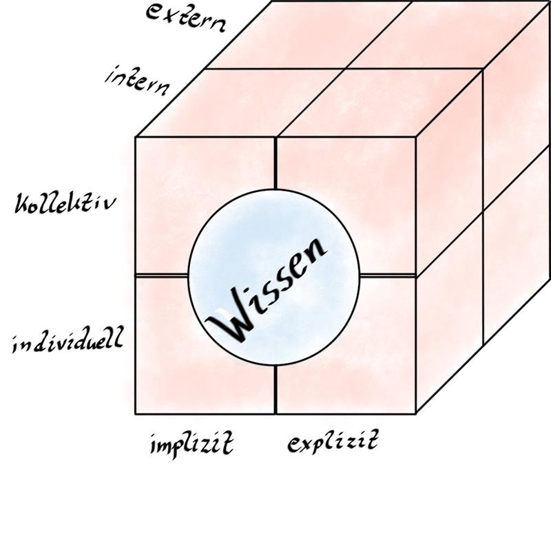
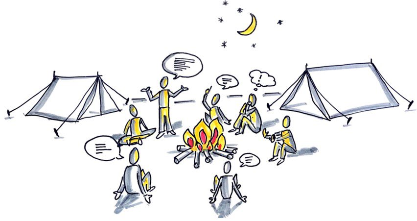

## Theorie  "Wissen teilen"

### Grundlagen

**Wissenstreppe**

Die **Wissenstreppe von Prof. Klaus North** erläutert anschaulich, wie
Daten, Informationen und Wissen sowie schließlich Können, Handeln und
Kompetenz zusammenhängen bzw. aufeinander aufbauen. Sie setzt dies in
Beziehung zu einem Modell für operatives Wissensmanagement - quasi
bottom-up ausgehend von dem Management der Daten und Informationen -
und strategischem Wissensmanagement, das quasi top-down eine Sichtweise
ausgehend von der Kompetenz und damit der Wettbewerbsfähigkeit als Ziel
nimmt.

Mehr dazu hier:  
<https://wissensmanagement.open-academy.com/category/grundlagen/wissensmanagement-modelle/wissenstreppe>

In diesem Video erläutert Dr. Angelika Mittelmann die Wissenstreppe
anhand eines „echten" Modells: [Die Wissenstreppe](https://youtu.be/zyYsHe1AaKU)

**Dimensionen des Wissens**

-  Individuelles vs. Kollektives Wissen
    -   Wissen eines Einzelnen <-> Wissen einer Organisation
  
-  Internes vs. Externes Wissen
  
-  Explizites vs. Implizites Wissen
    -   Explizit: Liegt „schriftlich" vor, kann kopiert werden.
    -   Implizit: Unbewusst, „Bauchgefühl"  
        (Bsp. Automechaniker - Motorengeräusch)
  

**Wissen & Wissensmanagement - Früher & Heute**

"Wissensmanagement 1.0" - Dokumenten-Management (ab Mitte der 90er
Jahre)

-   Annahme: Organisations-Wissen steckt in Dokumenten
-   Fokus: Informationen & Dokumente / Explizites Wissen
-   Aufgaben des Wissensmanagements: Dokumente sammeln - Speichern - Qualität sichern
-   Werkzeuge: Datenbanken
  

"Enterprise 2.0" - Beginn der Digitalen Zusammenarbeit (ab 2006)

-   Annahme: Organisations-Wissen steckt in den Köpfen der Experten
-   Fokus: Erfahrungen & Dialog, Zusammenarbeit / Implizites Wissen
-   Aufgaben des Wissensmanagements: Netzwerken - Dialog moderieren - Wissensträger coachen
-   Werkzeuge: Social Networks, Communities of Practice

**Beispiele für Wissen teilen**  
**Arten und Formate**
  

*Sketchnote "Austausch am Lagerfeuer" Tobias Grewe*

Das Gespräch ist die häufigste Form des Wissenteilens. Aber: Es ist
nicht skalierbar, es sei denn man kann es unabhängig von Zeit und Raum
nutzbar machen. Durch Dokumentation (Aufschreiben, Aufzeichnen, etc.)
wird das Wissen explizit und damit verfügbar.

Es gibt so viele Arten sein Wissen zu teilen: das Gespräch, die
zufällige Begegnung, Community, Intranet, Newsletter etc..  
Die Arten zur Wissenserfassung/-vermittlung lassen sich reduzieren auf:

-   Gespräch (persönlicher Austausch, Telefonkonferenz, Schulung, etc.)

-   Handschriftlich (Block und Bleistift, Flipchart, Sketchnote)

-   Dokument/Datei (Word, Excel, PowerPoint, Mail, aber auch OneNote,
    Mindmaps, etc.)

-   Beiträge (Blog, Communities, Foren, Wiki, etc.)

-   Bild (Screenshot, Foto von Flipcharts, Graphik, etc.)

-   Video (Screencast, Video mit verschiedenen Tools, etc.)

-   Audio (Diktiergerät des Smartphones, Podcast, etc.)

-   Überblick (Linksammlungen, kuratierte Listen, etc.)

Kennst du alle hier gelisteten Tools? Suche sie im Internet mit  "Was
ist... ? " oder frage in deinem Circle nach.
  

### Sichtbar werden - Working Out Loud (WOL)

Die Graphik von Tanmay Vora unter folgendem Link erläutert die 5
Elemente von Working Out Loud. Sie bezieht sich auf WOL als Ganzes, als
Mindset - nicht nur auf die Circle Methode:
<https://qaspire.com/2017/01/26/5-elements-of-working-out-loud-by-johnstepper/>

Die 5 Elemente von WOL hängen alle eng zusammen. Im Folgenden liegt der
Fokus allerdings auf  "Sichtbar werden ", was in der Graphik  "Visible
Work " entspricht.  
Weiterführende Infos: lernOS Lernpfad Offenheit & Vernetzung
([Überblick - lernOS für Dich Leitfaden
(cogneon.github.io)](https://cogneon.github.io/lernos-for-you/de/2-3-0-Lernpfad-OV/))

\newpage

