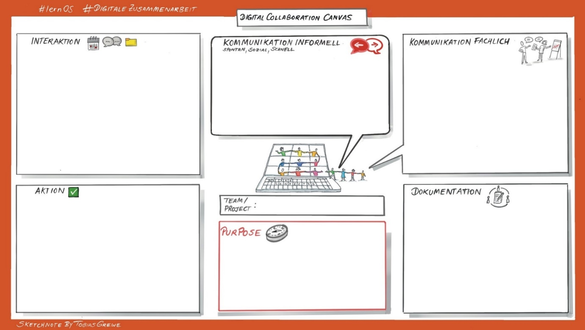

## Theorie  "Zusammenarbeit"

### Grundlagen: Zusammenarbeit

**Regeln für die Zusammenarbeit**

Grundlagen:  
[Microsoft: The Social Collaboration
Contract](https://techcommunity.microsoft.com/t5/yammer-blog/the-social-collaboration-contract/ba-p/364461)

Vertiefung:

-   [Atlassian - Playbook - Working at
    Atlassian](https://www.atlassian.com/de/team-playbook/examples)
-   [Atlassian - Playbook - Working Agreements in
    action](https://www.atlassian.com/de/team-playbook/plays/working-agreements)
-   [Büro-Kaizen: Spielregeln](https://www.buero-kaizen.de/)
-   [Expertenstudie: Microsoft Teams: Marketing Hype oder Game
    Changer?](https://lp.qbeyond.de/teamsstudie)

Idee für die Erarbeitung der Regeln für die Zusammenarbeit im Team:  
[Arbeitsvereinbarungen|Atlassian](https://www.atlassian.com/de/team-playbook/plays/working-agreements)
  

\newpage

### Collaboration Canvas
### (auch: Zusammenarbeits-Canvas)

**Canvas**

Wir haben in PowerPoint einen Collaboration Canvas vorbereitet, den ihr
zum Festhalten eurer Regeln für die Zusammenarbeit verwenden könnt
(siehe [Vorlagen](7-0-Vorlagen.md)).

Ihr könnt aber auch das folgende Bild als Hintergrund für andere Tools
nutzen:

Als Alternative zum Canvas könnt ihr folgenden Text als
Vorlage/Idee/Anregung in einem Tool eurer Wahl verwenden:

**Regeln für unsere Zusammenarbeit im lernOS Circle:**

**Ziel:** Unser lernOS Circle hat als gemeinsames Ziel  \[Ziel formulieren\]

Für die Zusammenarbeit im Team legen wir folgende Regeln für die
Zusammenarbeit fest:

Purpose / Ziel

-   Wofür braucht uns die Welt?
-   Wofür stehen wir jeden Morgen auf?
-   Wer ist unser Auftraggeber? (Kunde bzw. Motivation z.B. bei Ehrenämtern)
-   Was ist unser Auftrag als Team?

Interaktion

-   Wir treffen uns  \[1x wöchentlich - Dauer, Rhythmus, Ort, Zeitpunkt\]. Wenn wir Video nutzen, werden wir als
    Videokonferenzlösung für Treffen  \[Videokonferenztool\] verwenden.

-   Wir werden uns die Dokumente nicht gegenseitig per E-Mail zusenden,
    sondern die Links zu den Dokumenten in unserer
     \[Dokumentenbibliothek\] veröffentlichen und gemeinsam nutzen.

Aktion

-   Wir werden in der Zeit dazwischen unsere Aufgaben erledigen und sie
    für das nächste Treffen vorbereiten.

-   Wir verpflichten uns gegenseitig, den Vertrag über die
    Zusammenarbeit einzuhalten.

Kommunikation, informell (spontan, sozial, schnell)

-   Kurz und knapp: Für die spontane, schnelle soziale Kommunikation
    nutzen wir  \[Kommunikationstool\].

Kommunikation, fachlich

-   Wir sind dafür verantwortlich, vor dem nächsten Treffen uns in
    unserem  \[Kommunikationstool\] über Neuigkeiten zu informieren.

-   Konstruktiv: Für den **fachlichen** Austausch nutzen wir  \[Kanal im
    Kommunikationstool\].

Dokumentation

-   Wir werden unser  \[OneNote-Notizbuch\] für alle Treffen als
    Dokumentation verwenden.

-   Wir werden  \[Name des Tools (z. B. Planner)\] verwenden, um den
    Aufgabenstatus zu erfassen und unseren Status und die
    wichtigsten Meilensteine auf dem neuesten Stand zu halten.

-   Wir stellen sicher, dass die gesamte Arbeit (auch Dokumente, die
    noch in Arbeit sind) in der
    vereinbarten  \[Dokumentenbibliothek\] gespeichert wird. 

-   *Optional*: Wir werden diese spezielle
     \[Ordner-/Bibliotheksstruktur\] verwenden, um unsere Teamdokumente
    zu organisieren.

\newpage

### Gemeinsam an Dokumenten arbeiten

**Freigabe von Dokumenten in der Cloud (Beispiel M365)**

1.  Tipp: Gemeinsam gleichzeitig an einem Dokument arbeiten  
    Möchte man gemeinsam Inhalte in einem Dokument bearbeiten, mussten
    oftmals bisher mühsam Korrekturen und Beiträge einzelner Personen
    Stück für Stück in einem Dokument konsolidiert werden. Sobald
    Dokumente in der Cloud (beispielsweise auf SharePoint TeamSites oder
    in OneDrive) gespeichert sind, gibt es die Möglichkeit, dass mehrere
    Personen gleichzeitig an einem Dokument arbeiten (über Freigabe per
    Link (siehe Tipp 4)).  
    [Link zu weiteren Informationen & Anleitungen.](https://support.microsoft.com/de-de/office/zusammenarbeiten-an-word-dokumenten-mit-gemeinsamer-dokumenterstellung-in-echtzeit-7dd3040c-3f30-4fdd-bab0-8586492a1f1d)

2.  Tipp: Automatische Versionierung in Cloud Ablagen nutzen  
    Durch die Ablage in der Microsoft Cloud, werden Arbeitsstände von
    Dokumenten automatisch gespeichert und Versionen eines Dokuments
    nachgehalten. Falls man gemeinsam an Dokumenten arbeitet, gibt diese
    Funktion allen die Sicherheit, dass Dokumente und Arbeitsstände
    nicht aus Versehen gelöscht/überschieben und dadurch verloren gehen
    können.  
    [Link zu weiteren Informationen & Anleitungen.](https://support.microsoft.com/de-de/office/anzeigen-des-versionsverlaufs-eines-elements-oder-einer-datei-in-einer-liste-oder-bibliothek-53262060-5092-424d-a50b-c798b0ec32b1)

3.  Tipp: Änderungen nachverfolgen  
    Neben der Automatischen Versionierung bieten Word, Excel und
    PowerPoint Dokumente die Möglichkeit Änderungen nachzuverfolgen.
    Dadurch kann jeder sehen, welche Inhalte wann und von welcher Person
    bearbeitet wurden. Die Änderungsverfolgung lässt sich leicht im
    Hauptmenüpunkt  "Überprüfen " an- und ausschalten.  
    [Link zu weiteren Informationen & Anleitungen.](https://support.microsoft.com/de-de/office/nachverfolgen-von-%C3%A4nderungen-in-word-197ba630-0f5f-4a8e-9a77-3712475e806a#:~:text=%C3%96ffnen%20Sie%20das%20Dokument%2C%20das,Nachverfolgen%20von%20%C3%84nderungen%20zu%20aktivieren.)

4.  Tipp: Kommentarfunktion im Dokument nutzen  
    In Word, Excel und PowerPoint gibt es die Möglichkeit gezielt
    Kommentare z. B. an Textstellen, zu hinterlassen. Alle Personen, die
    das Dokument nutzen, können die Kommentare lesen und darauf
    antworten. So können Fragen, Informationen und Antworten zu den
    Inhalten in einem Dokument schnell und einfach ausgetauscht werden.  
    [Link zu weiteren Informationen & Anleitungen](https://support.microsoft.com/de-de/office/verwenden-von-modernen-kommentaren-in-word-edc6ae71-0a2d-49fe-8faa-986f1e48136a).

5.  Tipp: Dateien per Link teilen  
    Es ist ratsam Dateien immer zuerst auf der Cloud Ablage (z. B.
    TeamSite oder im pers. OneDrive) abzulegen und dann die Datei per
    Link im Teamskanal, einem 1:1 Chat oder Gruppenchat zu teilen. So
    bleibt die Datei am gewählten Ablageort. Teilt man eine Datei
    einfach per Drag & Drop in einem Chat wird diese automatisch im
    Kanalordner (Teams Chat) oder im OneDrive eines der Chatgruppen
    Teilnehmenden abgelegt. Es wird somit also eine Kopie der
    ursprünglichen Datei erzeugt.

**Wie teile ich Dokumente in einem Chat? (Beispiel M365)**

*Chat-Kommunikation ist für die Zusammenarbeit in einer Gruppe sehr
wichtig. In Microsoft Teams gibt es dafür mehrere Möglichkeiten: man
kann in einem Team in MS Teams die Kanäle nutzen - oder im persönlichen
Chat Bereich einen Gruppenchat anlegen. Auch Besprechungschats werden
oft für die Gruppenkommunikation genutzt. Die Optionen sind jeweils für
unterschiedliche Anwendungsfälle sinnvoll, unterscheiden sich aber in
wichtigen Details, wenn man per Chat auch Dokumente teilen möchte.*

| **Teams-Kanal**       | **Gruppenchat**      | **Besprechungschat**  |
|-----------------------|----------------------|-----------------------|
| **Vorteile**:         | **Vorteile**:        | **Vorteile**:         |
| Geteilte Dateien werden automatisch auf der TeamSite im entsprechenden Kanalordner abgelegt. Alle Teammitglieder (auch externe Personen/Gäste) haben automatisch auf Dateien Zugriff, die über die TeamSite und/oder direkt im Kanal geteilt werden. (wird auch beim Verlassen des Teams wieder entfernt!)  | Wenn eine neue Person zum Gruppenchat hinzugefügt wird, kann individuell entschieden werden, ob die Historie des Chats gesamtheitlich, teilweise oder gar nicht zur Einsicht freigegeben werden soll.  | Eignet sich gut für die Chat Kommunikation während und kurz nach einem Termin. |
|                       |                      |                       |
| **Nachteile**:        | **Nachteile**:       | **Nachteile**:        |
|                       | Intransparente Dateiablage  | Intransparente Dateiablage  |
| Keine direkte Einbindung von Personen außerhalb der M365-Gruppe möglich.  | Auch wenn alle Dateien scheinbar geordnet im Dateien Reiter des Chats sichtbar sind: es gibt es keine gemeinsame Dateiablage. Die geteilte Datei wird jeweils bei der Person im OneDrive im Ordner "Microsoft Teams Chat Dateien" abgelegt. Dort landen alle Dateien, die in 1:1 Chats, Gruppenchats und Besprechungschats von der Person per Drag & Drop geteilt wurden. Diese Ablage kann also schnell sehr unübersichtlich werden und viel Speicherplatz einnehmen.  | Auch wenn alle Dateien scheinbar geordnet im Dateien Reiter des Chats sichtbar sind: es gibt es keine gemeinsame Dateiablage (Details siehe Beschreibung "Gruppenchat"). |
|                       | Personen, die später zum Chat hinzugefügt werden, haben nicht automatisch auf die geteilten Dateien Zugriff. Sobald eine externe Person (= Gäste im genutzten M365 Tenant) dem Gruppenchat beitritt können keine Dateien mehr geteilt werden. Gäste können nicht auf die geteilten Dateien zugreifen. | Externe Personen (= Gäste im genutzten M365 Tenant) können geteilte Dateien nur sehen und abrufen, wenn sie einen Gast Account besitzen und sich auch über diesen Account in die Besprechung eingewählt haben. |

###   Tool-Sammlung

[verschiedene Tools zur gemeinsamen Texterstellung](https://www.selbstlernen.net/kooperatives-online-lernen-teil-3/)

\newpage

### Meetings effizient gestalten

Wie du mit einer besseren Organisation und Gestaltung deiner Meetings
mehr Zeit für das Wesentliche gewinnst.

**Meetings - Wofür?**

-   Entscheidungen

-   Abstimmungen

-   Brainstorming & Ideation

-   Präsentation von Ergebnissen (Pitch)

-   Austausch / Dialog & Lernen (Schulung)

-   Meeting = noch nicht abgeklärte, offene Punkte  
    Alles, was persönlich & live besprochen werden soll.

-   ≠ Aber NICHT für Information!

**Was braucht es?**

-   Agenda - Was steht an?

-   Ziel - Was wollen wir erreichen?

-   Einladung - nur an relevante Teilnehmer:innen  
    (= können ein Beitrag zur Zielerreichung leisten)

-   Zeitrahmen

-   Ergebnisprotokoll -- Aufgaben, Verantwortlichkeiten

**Wie machen wir das?**

-   Wir erstellen Agenda & Protokoll gemeinsam. Live.

-   Wir kommen vorbereitet und kennen die Materialien.

-   Keine Agenda - kein Meeting!

-   Wir gehen aus dem Meeting raus und kennen die nächsten Schritte:  
    jede:r weiß, was zu tun ist.

**Was kann im Vorfeld oder während des Meetings im Chat geklärt werden?**

-   „Müssen wir diesen Punkt „live" klären -  
    oder geht das auch asynchron im Netzwerk?"

-   Abstimmung durch „Like"

-   Offene Punkte / zu klärende Fragen im Kommentar

-   Keine Scheu vor „dummen Fragen" = Lern-Gelegenheit!

-   Hohe Motivation, Punkte vorab zu klären

-   Reduzierte Agenda bedeutet Kürzere Meetings

**Wer einen Punkt auf die Agenda setzt, ist als Topic Owner dafür verantwortlich:**

-   Materialien / Unterlagen zum Einlesen rechtzeitig bereitstellen

-   3 Tage vorher - sonst Verschiebung zum nächsten Termin

-   Klären von Fragen im Chat

-   Protokoll-Verantwortung: Schluss-Redaktion

**Im Meeting:**

-   Alle Rollen & Aufgaben werden von allen Beteiligten übernommen

-   Topic Owner = Moderatoren für ihre TOPs

-   Alle anderen sind aktiv beteiligt - in der Diskussion oder am
    Protokoll

**Vorteile von effizient gestalteten Meetings:**

-   Weniger & kürzere Meetings

-   Entscheidungsprozess: Schnellere Ergebnisse und Zeitersparnis

-   Mitarbeitende: Höhere Motivation & Engagement durch aktive Beteiligung

-   Virale Verbreitung in andere Projektteams

-   Wer die Vorteile erlebt hat, will nicht mehr zurück!

\newpage

