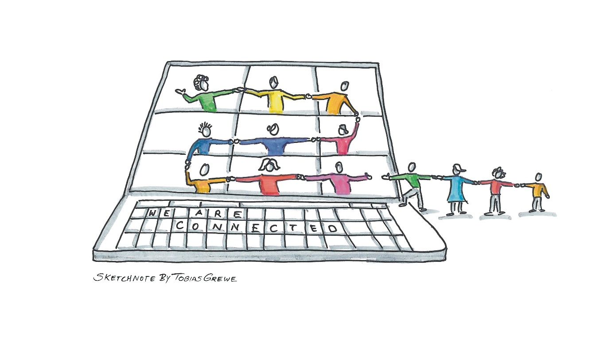

# lernOS Digitale Zusammenarbeit
Version 0.3 (23.08.2022)

Ein Leitfaden, um gemeinsam die digitale Zusammenarbeit im
Unternehmenskontext zu erlernen.

**Hashtags:** #lernOS #DigitaleZusammenarbeit #digitalcollaboration

> Britta Müller-Ruhnau, Daniel Prial, Fabienne Theis, Magnus Rode,
> Rainer Bartl, Stefanie Ammler

\newpage
