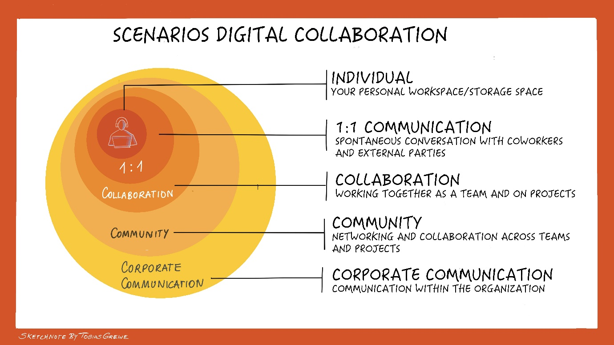

## Why digital collaboration?

The world in which we live and work is constantly changing. This
requires new competencies and skills, but also different ways of working
in order to meet the current challenges (e.g. digital transformation,
VUCA [^1]) world, mobile office, remote work, new work, etc.). This also
gives rise to new concepts of collaboration that must and may be
embraced

[^1]: VUCA stands for volatility, uncertainty, complexity and ambiguity.

This is exactly where the guide for digital collaboration comes in. In
addition to the tools, the focus is on methods and strategies for
digital collaboration, networking and knowledge dissemination.

Many of the formats and methods that appear in this guide also exist in
the analog world. This guide shows possibilities for implementing them
in a digital context. These can also be used both synchronously (at the
same time) and asynchronously (with a time delay). In this context, we
speak of collaboration tools that are used.

In the following graphic, you can see the different levels various
scenarios for digital collaboration for different audiences:

