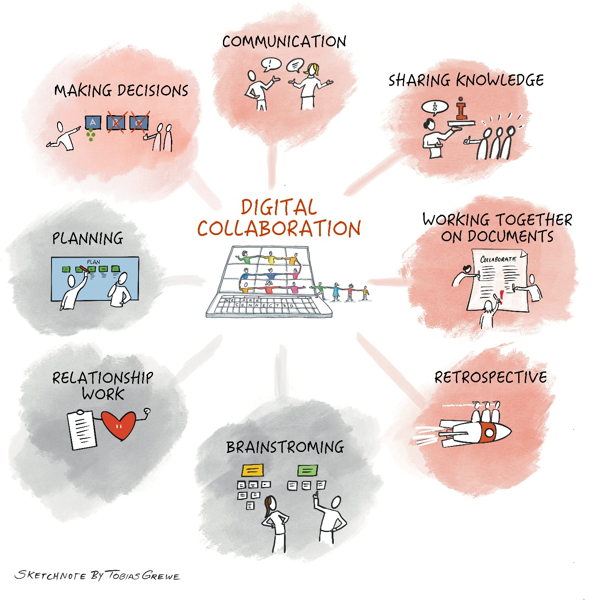

## What does digital collaboration involve?

Digital collaboration includes the following aspects, among others:

- **Communication (chat, video calls, Employee Social Networks)**

- **Sharing knowledge**

- **Working together on documents**

- **Retrospective**

- Relationship work

- **Making decisions**

- Planning

- Brainstorming

And that isn't an exhaustive list. In this guide, we focus on the
**aspects highlighted in bold**.

Once you have worked through the Learning Guide,

- you will understand how you and your team/work group can achieve your
  goals effectively and smoothly through digital collaboration,

- you will know various tools, methods and strategies for working
  together digitally, and

- you will have the foundation to work well together across all contexts
  and platforms.

**This digital collaboration guide covers a lot of topics that are not
always easy to present in an abbreviated form. So have the courage to
just get started. Start your own personal learning journey.**

