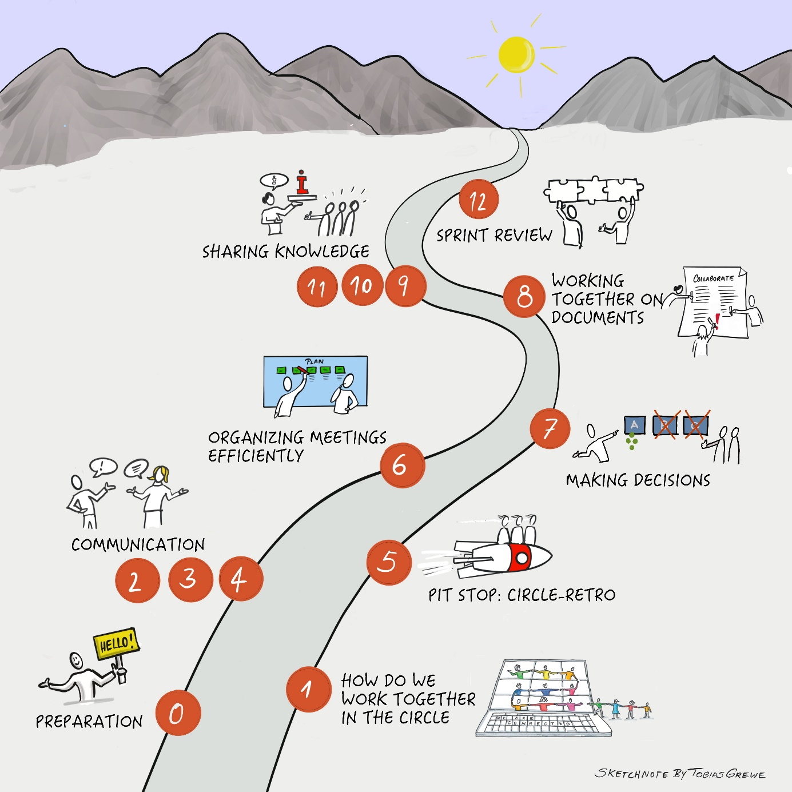

## Your learning journey at a glance

This
guide is divided into 12 Katas (exercises). We recommend working on
these in joint meetings or gatherings. The simplest way to work through
the learning journey would be over the course of 12 weeks with one Kata
and one meeting per week. Of course, the 12 Katas can also be used
freely however you like if this time frame does not fit.

The diagram shows the recommended order of the learning journey. Of
course, the order of the topics can also be chosen freely.

- The preparation meeting (Step 0) is about preparing the learning
  journey, being clear about your own motivation and agreeing with the
  learning group how you want to organize yourselves during this time.

- In the first Kata, we introduce you to the Collaboration Canvas and
  lay the foundation for your collaboration in your circle.

- Katas 2-4 deal with various aspects of the topic of communication. You
  will learn about suitable tools and channels for communication and
  find out how to optimize your communication.

- In Kata 5, you make a pit stop by performing a circle retrospective.

- In Kata 6, you will receive suggestions on how to organize meetings
  efficiently.

- The theme of Kata 7 is "Making decisions" and how this can be done
  digitally.

- In Kata 8, the focus is on working together on documents. You will
  learn what needs to be considered in digital collaboration.

- In Katas 9-11, the focus is on sharing knowledge. You deal with the
  aspects of "finding information", "valuing information" and
  "sharing information".

- A sprint review awaits you in Kata 12. This is where you reflect on
  your learning journey.

**Brief guide to planning your trip**

Each step on the learning journey requires

- Preparation (individual work)

And then a meeting (in the Circle / Group work) with the following
agenda:

- Check-in

- Main topic

- Check-out

You prepare an exercise (what we're calling Kata) before the group
meeting so that you can discuss it together in the circle/working group.

*Scheduling*

Please allow at least 2 hours per session: 1 hour (or more) for your
Kata and 1 hour for the subsequent group meeting. Preparation and
follow-up times may vary.

Digital collaboration is a very wide-ranging topic. Not all aspects can
be covered equally. Your level of knowledge will also vary in the
individual areas.

Please determine your focus and decide for each Kata whether you want to
do more in addition to the learning path - there are further tips and
tasks for you in each Kata.

**And now: have fun on your journey!**
