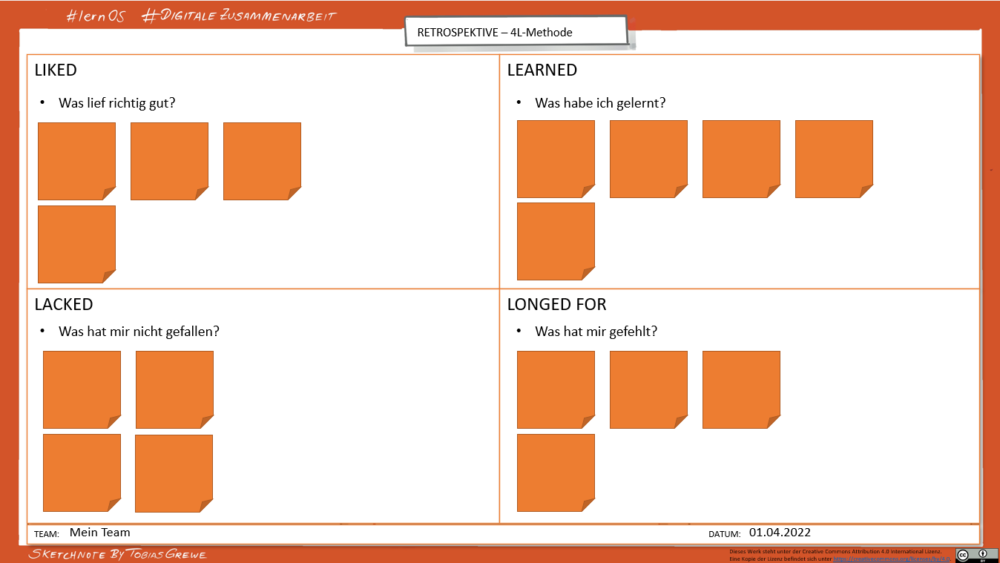

## Kata 5 - Pit stop: Circle-Retro

Take a look back together as a circle, as a group.

Retrospectives are an opportunity to learn from our experiences and
improve. They help us to reflect on what went well, what went wrong and
what we can do differently.

In this Kata you will explore why retrospectives are important, how you
could conduct them and what benefits they have for you and your teams.

Then do a retrospective on your collaboration at a Circle up to this
point.

How did it go? What do you want to leave out? What would you like more
of?

#### Preparation (individual work)

- Read "Kata 5 - Retrospective" (see below), do the exercises.

#### Agenda (circle/group work)

- **Check-in:** *(10 minutes)*  
  What has been on your mind this past week in relation to digital
  collaboration?  
  Two-minute timebox per Circle member.

- **Main topic**: *(45 minutes)*

  Present your results and findings from the Kata 5 retrospective to
  each other and discuss them.

  Which retro template do you want to use to carry out the Circle pit
  stop?  
  (If you can't decide, just try this [template](6-01-Templates.md): 4L)  
  Use it **to reflect together on how your previous collaboration in the
  Circle has gone**.

- Then, write down your points (e.g. in bullet points on sticky notes),
  and talk about them. Try to understand each other and - if you have
  time - find solutions.

- Consider together whether rules in the collaboration canvas should be
  adapted or expanded, if necessary, expand the [collaboration canvas](5-01-Cooperation.md#Collaboration-Canvas) with your
  new findings and formulate your common rules of collaboration.

- **Check-out:** *(5 minutes)*  
  What will you do before the next meeting?

#### Kata - Retrospective

In this Kata you will get to know the possibilities of retrospective
experience exchange. You will get an overview first and try out a
retrospective together in your circle, your group, in the next session.

You can use the retrospective format (retro for short) in the future: in
project groups or to evaluate joint processes or events, for example.
Retrospectives are used in the agile approach.

- Take a look at the various tools and templates and discuss them with
  your Circle at the next meeting. If you have already heard of retro,
  you can go straight to the exercise part, but if you would like to
  find out more about what a retro is and what retrospective means, then
  take a look at the [Retrospective theory](5-03-Retrospective.md).

  - Example of a retro:

    **4L method**:  
      

    You can find a PowerPoint template for this under [template](6-01-Templates.md).

  - Use templates or templates:

    - [Mural
    https://www.mural.co/templates/retrospective](https://www.mural.co/templates/retrospective)

    - [Miro
    https://miro.com/templates/retrospective-tool/](https://miro.com/templates/retrospective-tool)
    and <https://miro.com/templates/4-ls-retrospective/>

    - [Trello
    https://trello.com/b/hkaQsLWx/sprint-retrospectives](https://trello.com/b/hkaQsLWx/sprint-retrospectives)

  - Further material:

    - <https://retromat.org/de/> \[GERMAN\]

    - <https://retromat.org/blog/best-retrospective-for-beginners/>

    - <https://www.liberatingstructures.com/7-15-solutions/>

  - Instructions:

    - Retrospective
    <https://www.atlassian.com/team-playbook/plays/retrospective>

    - 4L retrospective
    <https://www.atlassian.com/team-playbook/plays/4-ls-retrospective-technique>

    - Starfish method
    <https://t2informatik.de/wissen-kompakt/starfish-retrospektive/>
    \[GERMAN\]

  - Examples:

    - <https://www.collaboard.app/en/blog/retrospective-online-whiteboard>

    - <https://agilescrumgroup.de/retrospektive-formen-mit-beispielen-und-ideen/>
    \[GERMAN\]

  Choose one of the templates explored above and make a Circle pit stop
  based on this retrospective. Reflect together with your Circle on how
  your collaboration has gone so far, what you definitely want to keep
  and what you want to leave out. Think about this now so that you can
  get started promptly at the next meeting.

#### If you want to do more: 

- If you have already tried the retro within the learning journey, the
  next step could be to try it out with your own team or another group.

